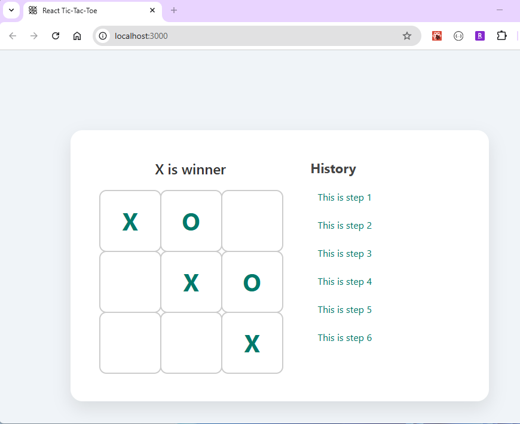

# React Tic-Tac-Toe

A simple and interactive Tic-Tac-Toe game built with React. This project is designed as a learning exercise to explore React components, hooks, and state management in a fun and intuitive way.



## 🧩 Features

- Playable 2-player game (Player X and Player O)
- Interactive UI with click-based moves
- Win and draw detection
- Game reset functionality
- Responsive and clean design

## 📁 Project Structure

```bash
react-tic-tac-toe/
├── public/
│ └── index.html
├── src/
│ ├── Board.jsx
│ ├── Game.jsx
│ ├── History.jsx
│ ├── index.js
│ ├── Square.jsx
│ └── style.css
├── package.json
└── README.md
```
Each file serves a specific purpose:
- **Game.jsx**: The root component that renders the `Board` component.
- **Board.jsx**: Contains the game board logic and manages the state of the squares.
- **Square.jsx**: Represents an individual square on the board, displaying its state and handling click events.
- **Historey.jsx**: Displays a clickable list of past game states
- **index.js**: The main entry point that renders the app into the DOM.
- **style.css**: Contains the styles for the Tic-Tac-Toe game layout and components.
- **package.json**: Lists project dependencies and provides scripts for development and production builds.
- **README.md**: Documentation for the project, including setup, usage, and structure.

## 🛠️ Built With

- [React](https://reactjs.org/) – Frontend framework
- JavaScript (ES6+)
- HTML & CSS

## 📦 Installation

Clone the repo and run it locally:

```bash
git clone https://github.com/Shaobangzhu/react-tic-tac-toe.git
cd react-tic-tac-toe
npm install
npm start
```

The app will run locally at http://localhost:3000.

## 🧪 How to Play

- The game starts with Player X.

- Click on a square to place your mark.

- Players alternate turns.

- The game announces a winner or a draw.

- Click "Restart" to play again.

## 📄 License
This project is open source and available under the MIT License.